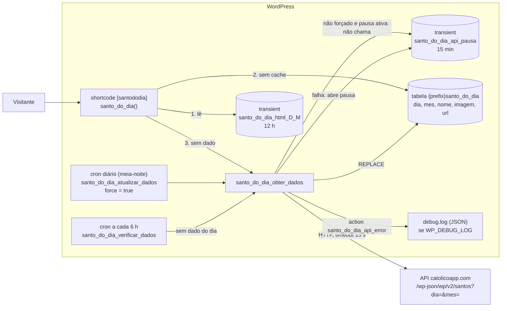

# Arquitetura e fluxo de dados

O plugin não tem serviços próprios: roda dentro do WordPress e depende de uma única API externa.

## Dependências

| Dependência | Tipo | Se falhar |
|---|---|---|
| `SANTO_DO_DIA_API_URL` (catolicoapp.com) | HTTP, sem autenticação | Mostra o dado já gravado; sem dado, mensagem "temporariamente indisponível" e pausa de 15 min |
| Tabela `{prefix}santo_do_dia` | MySQL do WordPress | Erro `santo_do_dia_database_error` |
| wp-cron | Agendador do WordPress | Sem visitas não há cron; o shortcode busca sob demanda |

## Pontos de extensão

- `do_action( 'santo_do_dia_api_error', WP_Error $error )`: disparada em toda falha de API ou de
  gravação. Use-a para ligar Sentry, alertas ou métricas no site que instala o plugin.

## Configuração

O plugin não lê variáveis de ambiente nem arquivo `.env`. Toda a configuração é
constante em `santododia.php` (`SANTO_DO_DIA_API_URL`, `SANTO_DO_DIA_API_PAUSE_SECONDS`).
O único ajuste do WordPress que muda o comportamento é `WP_DEBUG_LOG` (liga o log JSON).

## Decisão: sem telemetria

Decidido pelo mantenedor em 2026-09-29. O plugin **não** envia tracing, métricas, erros
(Sentry e afins), analytics nem eventos de deploy para serviços externos. Ele roda em sites de
terceiros, e a diretriz 7 do WordPress.org proíbe coletar dados sem consentimento explícito.

A observabilidade fica com quem instala o plugin:

- `WP_DEBUG_LOG` liga o log JSON dos erros (com URLs e e-mails removidos);
- a action `santo_do_dia_api_error` recebe o `WP_Error` e pode ser ligada a Sentry, alertas
  ou métricas no próprio site.

Do lado do repositório, os sinais são: CI, cobertura e tempos dos testes (artefatos),
Semgrep/gitleaks (Security) e o workflow semanal de compatibilidade, que abre issue.
